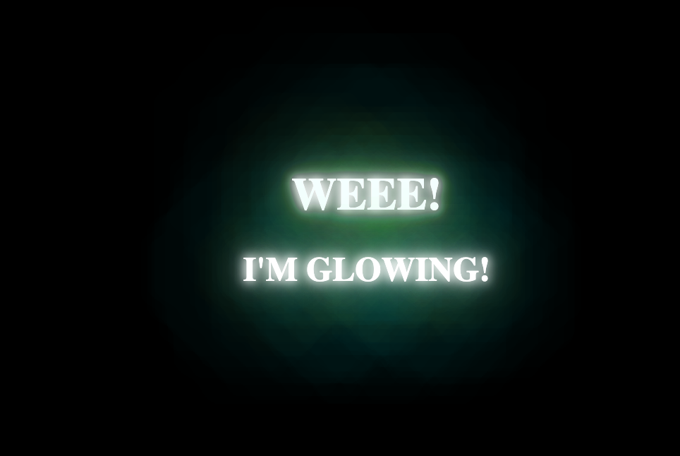

# CSS-Exercises-and-Projects

A collection of CSS projects and exercises to practice different techniques and effects.

## Projects

### 1. Neon Text Effect (`neon-text/`)

A glowing neon text animation with realistic flickering effects using CSS keyframes and text-shadow layering.

